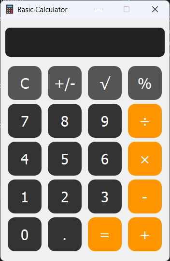

# ✨ Basic Calculator 🖥️🧮

A sleek and user-friendly calculator desktop application built with **PyQt5**. This project showcases a modern UI design, custom error handling, and advanced math features like square root 🧮 and sign toggling ➕➖.

---

## 🚀 Features

- 🎨 **Beautiful UI:** Dark theme, rounded buttons, and color-coded operations for ease of use  
- ⚠️ **Robust Error Handling:** Informative popups guide you through invalid inputs  
- 🧩 **Modular Code:** Clean separation of UI, logic, and error handling for simple extensions  
- 🔒 **Safe Calculations:** Expression evaluation with preprocessing for square roots and secure `eval` usage  

---

## 📸 Screenshot

  

---

## 💻 Installation

1. Clone this repository:

<pre>git clone https://github.com/DShaKi/basic-calculator.git
cd basic-calculator </pre>

2. Install dependencies from `requirements.txt` (Python 3.7+ required):

<pre>pip install -r requirements.txt</pre>

3. Run the app:

<pre>python main.py</pre>

---

## 🛠️ Project Structure

- `main.py` — Main UI and application bootstrap  
- `logic/` — Core calculator logic and expression processing  
- `error_handling.py` — Exception analysis and user-friendly error dialogs  
- `ui/` — PyQt5 layout, widgets, and styling  
- `resources/` — Images, icons, and screenshots  
- `tests/` — Unit and integration tests  
- `requirements.txt` — Project dependencies  

---

## 🤝 Contributing

Contributions warmly welcome! 💖 Please open an issue to report bugs or suggest features. Pull requests are encouraged! ✨

---

## 📄 License

Apache 2.0 License © 2025 — see the [LICENSE](LICENSE) file for details.

---

## 📬 Contact

Need help or want to share feedback? Reach out via GitHub Issues or email: shayan.ker85@gmail.com 📧
